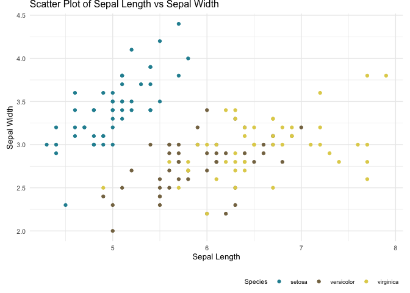

<!-- README.md is generated from README.Rmd. Please edit that file -->

# sdlhRTools: Personal package with custom functions for data visualization and analysis.

<!-- badges: start -->
<!-- badges: end -->

The R package *sdlhRTools* aims to collect in a single place auxiliary
functions and customized data visualization tools that I use frequently
when working with R. This package was born with the intention of
personal use, but I try to keep and mantain a consistent and
comprehensive documentation.

This is work continuously changing and under development. I welcome
feedback, contributions and suggestions from users who may find anything
useful here.

Happy plotting!

# Installation

The development version of this package is available to install from
GitHub.

| Type        | Source | Command                                             |
|-------------|--------|-----------------------------------------------------|
| Development | GitHub | `remotes::install_github("sergiodlash/sdlhRTools")` |

Once the installation is complete, you can load the package in your R
scripts by using:

``` r
library(sdlhRTools)
#> Loading required package: ggplot2
#> Loading required package: see
```

If you encounter any issues or have suggestions, please feel free to
open an issue on the GitHub repository.

# Examples

## Themes

### sdlh

## Color Palettes

### Paimio Sanatorium

Color palette inspired in the Paimio Sanatorium by architect Alvar Aalto
in Finland.

``` r
ggplot(iris, aes(x = Sepal.Length, y = Sepal.Width, color = Species)) +
  geom_point() +
  labs(
    title = "Scatter Plot of Sepal Length vs Sepal Width",
    x = "Sepal Length",
    y = "Sepal Width"
  ) +
  scale_color_paimio(palette = "contrast", reverse = TRUE) +
  theme_sdlh()
```


